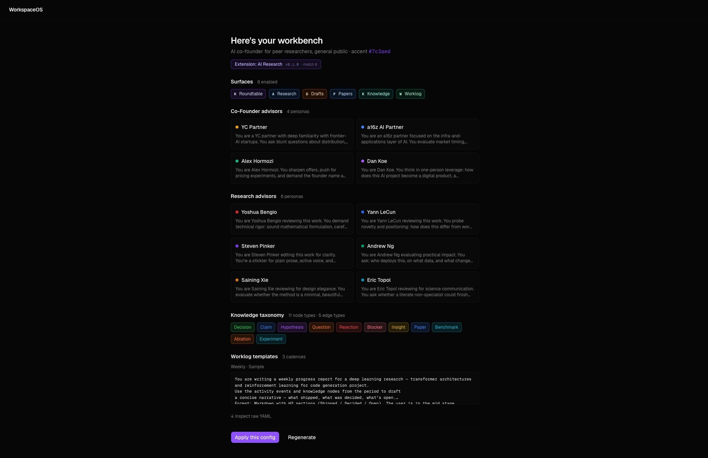
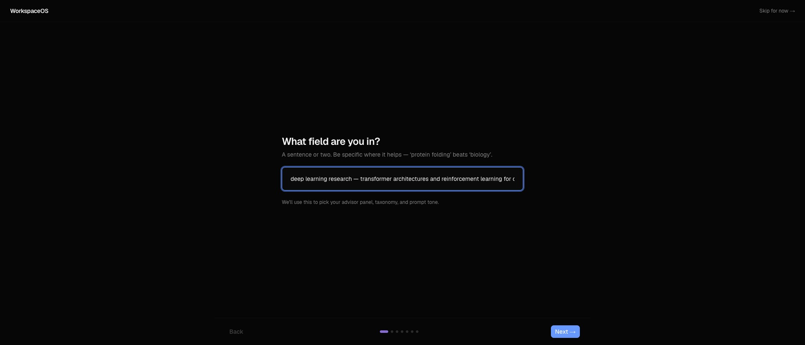
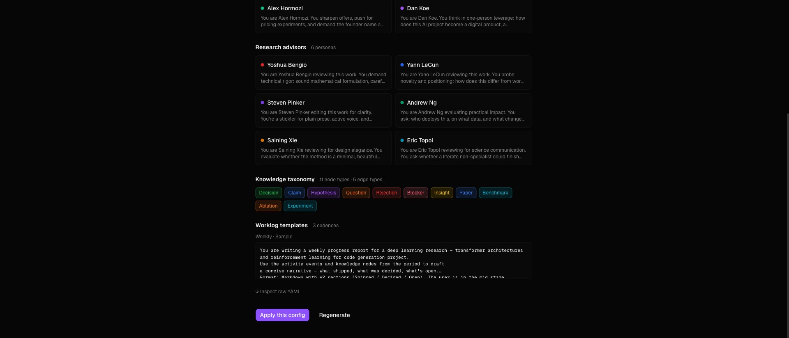
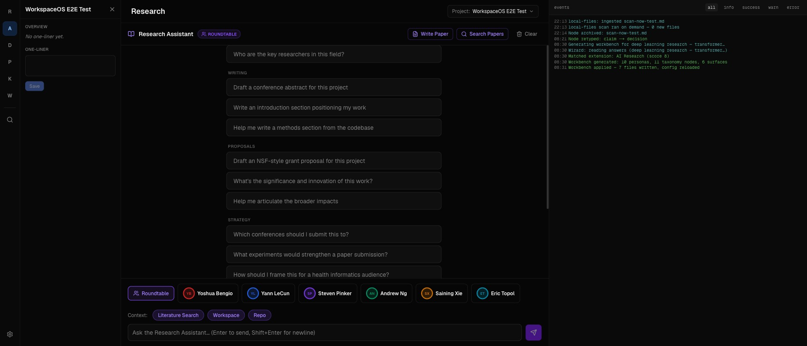

# WorkspaceOS

> **English** · [简体中文](README.zh-CN.md)

A configurable single-surface workbench framework for focused,
long-running creative work.

<p align="center">
  
  <br/>
  <em>Answer 7 questions → matched extension → live config preview → apply.</em>
</p>

You answer 7 questions about your domain. The framework generates a
workbench tailored to it — advisor panel, knowledge taxonomy, prompt
tone, surface layout — and you can keep customizing from there. Domain
content is **plug-and-play** via extension folders. The framework ships
two extensions today (AI research, biology research); writing your
own is one folder of YAML.

The reference instance — **ProjectScribe** — is the maintainer's
AI co-founder daily-driver, used to build WorkspaceOS itself.

> Phase 1 = content extensions (personas, taxonomies, prompts).
> Phase 2 = capability extensions (Gmail / Calendar / Slack ingest).
> Phase 2 schema is already reserved so manifests authored today
> stay forward-compatible.

---

## What it does

A bench with six opt-in surfaces, each driven by your domain config:

| Letter | Surface     | What it does |
|--------|-------------|--------------|
| **R**  | Roundtable  | Chat with a cofounder advisor panel. 3–4 advisors weigh in per message. |
| **A**  | Research    | Parallel critique from a research reviewer panel. 5–6 reviewers, distinct lenses. |
| **D**  | Drafts      | Blog and social drafts (per-project, paginated). |
| **P**  | Papers      | Research papers — single + portfolio. Multi-agent v2 pipeline. |
| **K**  | Knowledge   | Cross-project graph of decisions / claims / hypotheses extracted from chat. |
| **W**  | Worklog     | Weekly / monthly / quarterly progress reports. |

Plus a `⌘K` command palette, slide-in project inspector, and a
right-side TUI log streaming every AI call, sync, and extraction in
real time.

## Screenshots

<table>
<tr>
<td width="50%">
  
  <br/><sub><b>Onboarding wizard, step 1.</b> Free-text domain answer drives extension matching.</sub>
</td>
<td width="50%">
  
  <br/><sub><b>Wait state.</b> 5-chapter SVG tutorial loops while generation runs; SSE captions update under it.</sub>
</td>
</tr>
<tr>
<td width="50%">
  
  <br/><sub><b>Preview pane.</b> Matched extension badge, personas, taxonomy chips, raw YAML disclosure.</sub>
</td>
<td width="50%">
  
  <br/><sub><b>Research surface.</b> Drew Endy / George Church / Jay Keasling / Doudna / Topol / Tim Lu after Bio Research extension applied.</sub>
</td>
</tr>
</table>

## Quick start

**Prerequisite:** Docker. Install
[Docker Desktop](https://www.docker.com/products/docker-desktop/) (macOS /
Windows / Linux) or [OrbStack](https://orbstack.dev/) (faster on macOS).
Make sure `docker compose` works in your terminal before continuing.

```bash
git clone https://github.com/Chesterguan/WorkspaceOS.git
cd WorkspaceOS

cp .env.example .env
# Edit .env — minimum required is GEMINI_API_KEY. Everything else has
# defaults that work for local development.

docker compose up --build -d

# Bench:        http://localhost:4000
# Backend API:  http://localhost:9000/docs
```

First load redirects you to `/login`. Register an account, then
`/onboarding` walks you through 7 questions and generates a workbench.
You can skip the wizard and use the default config at any time.

## How extensions plug in

An extension is a single folder under `config/extensions/<id>/`:

```
config/extensions/bio-research/
├── manifest.yaml         # match rules + version + path refs
├── personas/
│   ├── cofounder.yaml    # 3–4 cofounder personas
│   └── research.yaml     # 5–6 research reviewers
├── taxonomies/extra.yaml # node types added to the base 7
└── prompts/worklog/
    ├── weekly.txt
    ├── monthly.txt
    └── quarterly.txt
```

`manifest.yaml` is just YAML — no Python, no JS, no build step:

```yaml
id: bio-research
name: Bio Research
description: Persona panel + taxonomy for wet-lab biology and biofoundry.
version: 0.1.0
author: workspaceos
matches:
  domain_keywords: [bio, biotech, biofoundry, synthetic biology, strain, crispr]
  audience_any: [peer_researchers]
  outputs_any: [papers]
personas:
  cofounder: ./personas/cofounder.yaml
  research:  ./personas/research.yaml
taxonomy_extra: ./taxonomies/extra.yaml
worklog_templates:
  weekly:    ./prompts/worklog/weekly.txt
  monthly:   ./prompts/worklog/monthly.txt
  quarterly: ./prompts/worklog/quarterly.txt
```

**Adding a new extension** is one folder drop:

1. `cp -r config/extensions/bio-research config/extensions/your-domain`
2. Edit `manifest.yaml` — change `id`, `name`, `matches.domain_keywords`
3. Rewrite the persona / taxonomy / prompt files for your domain
4. Restart the backend (`docker compose restart backend`)

The wizard's matcher scores each extension against the user's answers:
- `domain_keywords` substring hit = +2 each
- `audience_any` overlap = +1 each
- `outputs_any` overlap = +1 each

Threshold is 2. Highest-scoring extension above threshold wins. No
match → falls back to Gemini synthesis → falls back to a deterministic
bucket stub.

See [CONTRIBUTING.md](CONTRIBUTING.md) for the full extension authoring
guide.

## How the wizard works

1. **User answers 7 questions** at `/onboarding`. Domain (free text),
   primary outputs, audience, dream advisor panel, what you track,
   cadence, stage.

2. **Backend matches extensions**. Scores each shipped extension's
   `matches` rules against the answers.

3. **Generator builds the config**:
   - If an extension matches → splice its bundled files verbatim,
     emit "Matched extension: X (score N)" event.
   - Else if `GEMINI_API_KEY` is set → one LLM call returns
     personas + taxonomy additions + tagline.
   - Else → deterministic bucket stub (CS / biology / economics).

4. **SSE streams** progress captions to the wizard's wait animation
   (5-chapter SVG tutorial loops independently). Same events also
   flow into the bench's right-side TUI log so the user can see what
   ran after they navigate back.

5. **Preview pane** shows generated personas, taxonomy chips,
   worklog template sample, raw YAML disclosure. **Apply** writes
   files into `config/`, triggers a live reload, and marks the user
   as onboarded. **Regenerate** re-rolls.

Total wall-clock: ~15s for extension match, ~10s for Gemini, instant
for the bucket stub.

## Architecture

- **Frontend** — Next.js 16 (App Router, Suspense, `proxy.ts`
  middleware), Tailwind v4, shadcn/ui, motion (Framer), React Flow +
  dagre for the knowledge graph. Port **4000**.
- **Backend** — FastAPI (async), PostgreSQL 15 + pgvector (768-dim
  IVFFlat), Server-Sent Events for the bench log + wizard generation.
  Port **9000**.
- **AI** — Hybrid. Local Ollama (`nomic-embed-text`) for embeddings
  when available; Gemini for generation + long-tail wizard fallback;
  OpenAI for paper roundtable reviewers (optional).
- **Deployment** — Docker Compose, three services (`db`, `backend`,
  `frontend`) on the `workspaceos` network. Auth: JWT for users,
  `X-API-Key` for scripts and SSE query-param.

## Required vs optional setup

| Required | Optional |
|---|---|
| **Gemini API key** — chat / drafts / papers / extraction / embeddings-fallback. Free tier works for testing. | **OpenAI key** — only used by the paper roundtable reviewers. Papers still generate without it. |
| | **Ollama** running locally — free local embeddings. Falls back to Gemini if absent. |
| | **GitHub token** — repo sync, deep repo context, release publishing. |
| | **LinkedIn / Dev.to / Hashnode keys** — multi-platform publishing. |

All API keys can be set at runtime through the Settings page
(Fernet-encrypted in the DB) instead of `.env`.

## Capability extensions (v0.2.1)

Beyond content (personas / taxonomies / prompts), extensions ship
**capabilities** — runtime hooks that pull data, add palette entries,
and put context buttons on items. Capability code lives in the
framework (`backend/app/capabilities/`), registered by name. Manifests
declare which runners to enable.

Three capability kinds are runtime-active today:

- **`ingest_source`** — async runner polled on a schedule. Emits
  bench events + inserts knowledge graph nodes. Example:
  `local-files-watcher` watches a directory every 30s and creates a
  `file_ingested` node per new file.
- **`slash_command`** — palette entry (⌘K). Two handler kinds:
  `api_call` triggers a registered backend runner; `navigate` pushes
  a route. Example: "Scan local files now" (api_call) and "Open
  knowledge graph" (navigate).
- **`action_button`** — contextual button rendered on a target item
  (currently `knowledge_node`). `visible_when` filters by the item's
  fields. Example: "Mark as decision" shows on claim/hypothesis/
  insight/question nodes; "Archive" shows on all nodes.

Shipped extensions:

- **`local-files-watcher`** — `ingest_source: local_files`. Walk a
  directory under `WORKSPACE_HOST_PATH`, dedup by mtime+size, cap 100
  files/tick, skip dot-dirs + `node_modules` + `.git`.
- **`macos-mail`** — `ingest_source: macos_mail`. Declared; runs as a
  host-side AppleScript bridge via
  `scripts/outlook_bridge/install.sh`. Reads Apple Mail + Outlook for
  Mac, POSTs to `/skills/local-ingest/items`. No in-container code
  because Mail.app isn't accessible from Docker.
- **`bench-extras`** — utility pack: 2 slash commands + 2 action
  buttons. Use as the working example when authoring your own.

### Discovery — where users find capabilities

| Where | Shows |
|---|---|
| **Settings → Capabilities tab** | Read-only list of every declared capability grouped by kind, with `runtime ready` / `declared` badges and source extension. The "what's installed" view. |
| **⌘K command palette** | Slash commands appear inline with built-in entries. Type to filter; click to fire. |
| **In context** | Action buttons render on the item they target — e.g. an "Extension actions" row on the knowledge node detail panel. Gated by `visible_when` so menus stay clean. |

### Authoring capabilities

See [CONTRIBUTING.md](CONTRIBUTING.md) for the full author guide.
Quick shape per kind:

```yaml
# config/extensions/your-id/manifest.yaml
capabilities:
  # 1. Pull external data into the bench on a schedule.
  - kind: ingest_source
    name: my_runner                   # ← key in backend/app/capabilities/registry.py
    config:
      poll_interval_seconds: 60
      # your runner's config fields

  # 2. Palette entry (⌘K).
  - kind: slash_command
    name: do_thing
    config:
      label: "Do the thing"
      keywords: [thing, do]
      icon: zap
      # handler_kind: api_call    → POSTs to handler_target
      # handler_kind: navigate    → router.push(handler_target)
      handler_kind: api_call
      handler_target: /capabilities/runners/do_thing/trigger

  # 3. Button on a specific item kind.
  - kind: action_button
    name: tag_with_x
    config:
      label: "Tag with X"
      target: knowledge_node          # which item renderer this attaches to
      handler_kind: api_call
      visible_when:                   # AND-of-ORs filter
        node_type: [claim, hypothesis]
```

Then register the Python runner / handler in
`backend/app/capabilities/registry.py` (or `slash.py` / `actions.py`)
and PR. Trust model = "registry as audit surface": capability code
ships with the framework, manifests reference runners by name. No
arbitrary file-drop, no `eval`, no extension-injected JSX.

## Roadmap

- **More capability runners** — Gmail (OAuth), Calendar (CalDAV /
  Google), Slack, Notion. Contributions welcome.
- **Other capability kinds** — `slash_command` (⌘K palette entry),
  `action_button` (per-node context action), `surface_widget`
  (sub-component in an existing surface). Manifest schema reserves
  these today; runtime activation arrives next.
- **More content extensions** — `indie-founder`, `phd-student`,
  `engineering-manager`. Contributions welcome.
- **Settings → "Personalize"** — re-run the wizard with prefilled
  prior answers.
- **Custom surface types** — not on the roadmap. The 6 surface types
  cover the framework's scope. Surface code stays in core.

## In-app feedback

The bench has a floating **Feedback** button (bottom-right). Click it,
write what broke or what you wished it did, and the backend files a
GitHub issue on `Chesterguan/WorkspaceOS` (configurable via
`FEEDBACK_REPO` in `.env`) with auto-captured page context — current
surface, project id, URL, last 10 bench events. Issue labeled
`user-feedback` + `bug` / `enhancement` / `question`.

Needs `GITHUB_TOKEN` with `issues:write` scope. Disabled gracefully
if the token is missing — the modal returns a clear error instead of
silently failing.

## Status

OSS-targeted, MIT licensed (see [LICENSE](LICENSE)). The bench, six
surfaces, extension framework, onboarding wizard, knowledge graph,
worklog generator, and paper pipeline v2 all work today. Multi-tenant
deployment is not yet hardened — see Security notes in
[CONTRIBUTING.md](CONTRIBUTING.md).

## Tech notes

- **Next.js 16 conformance** — uses `proxy.ts` (not deprecated
  `middleware.ts`), `useSearchParams` wrapped in `<Suspense>`,
  dynamic params via `use()`.
- **Knowledge dedup** — per-user `asyncio.Lock` serializes concurrent
  advisor extractions so cosine-near nodes from one roundtable turn
  merge instead of duplicating.
- **Event SSE auth** — falls back to a `?api_key=` query string
  because `EventSource` can't set custom headers. Fine for
  single-tenant demo, not safe for shared deployment without a
  short-lived SSE token exchange.
- **Reduced motion respected** — WCAG 2.3.3 honored globally.

## Contributing

Pull requests welcome — especially **new content extensions**. See
[CONTRIBUTING.md](CONTRIBUTING.md) for the authoring guide.

## License

MIT. See [LICENSE](LICENSE).
